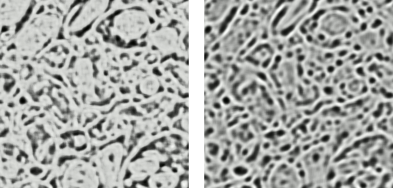
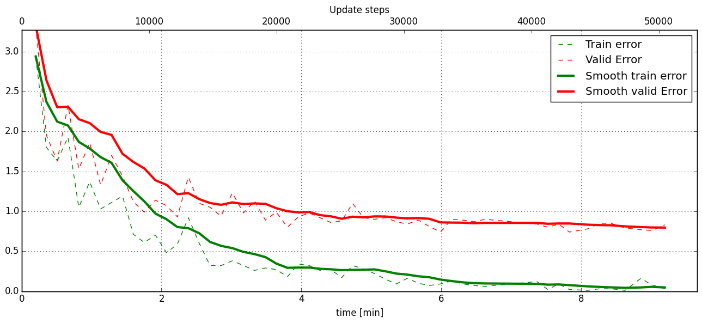
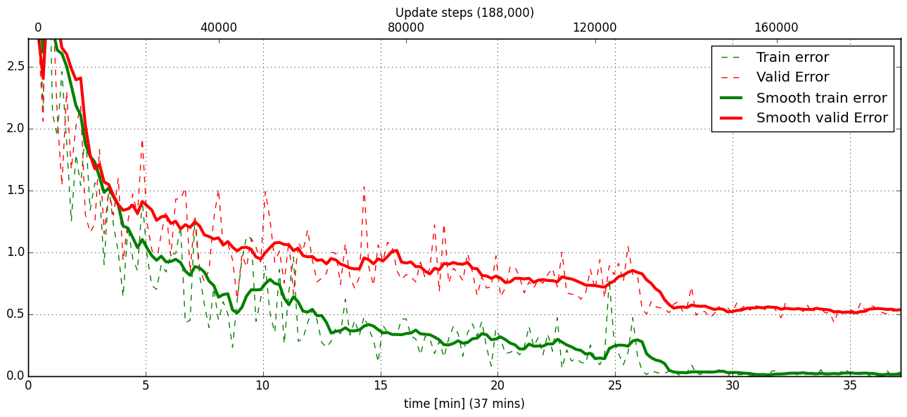
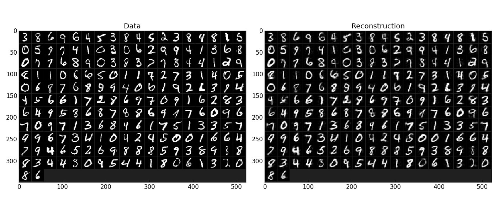

.. _examples:

********
Examples
********

This page gives examples for different use cases of ELELKTRONN. Besides, the examples are intended to give an idea of how custom network architectures could be created and trained without the built-in pipeline. To understand the examples, basic knowledge of neural networks (e.g. from :ref:`training`) is recommended. The details of the configuration parameters are described :ref:`here <pipeline>`.

.. contents::
	 :local:
	 :depth: 2

3D Neuro Data
=============

This task is about detecting neuron cell boundaries in 3D electron microscopy image volumes. The more general goal is to find a volume segmentation by assigning each voxel a cell ID. Predicting boundaries is a surrogate target for which a CNN can be trained (see also the note about target formulation :ref:`here <data-format>`) - the actual segmentation would be made by e.g. running a watershed on the predicted boundary map. This is a typical *img-img* task.

For demonstration purposes, a very small CNN with only 70k parameters and 5 layers is used. This trains fast but is obviously limited in accuracy. To solve this task well, more training data would be required in addition.

The full configuration file can be found in ELEKTRONN's ``examples`` folder as ``neuro_3d_config.py``. Here only selected settings will be mentioned.

Getting Started
---------------

1. Download `example training data <http://elektronn.org/downloads/neuro_data.zip>`_  (~100MB)::

    wget http://elektronn.org/downloads/neuro_data.zip
    unzip neuro_data.zip

2. Edit ``save_path, data_path, label_path, preview_data_path`` in the config file ``neuro_3d_config.py`` in ELEKTRONN's ``examples`` folder

3. Run::

    elektronn-train </path/to_config_file> [ --gpu={auto|false|<int>}]

4. Inspect the printed output and the plots in the save directory

Data Set
--------

This data set is a subset of the zebra finch area X dataset j0126 by `Jörgen Kornfeld <http://www.neuro.mpg.de/mitarbeiter/43611/3242756>`_.
There are 3 volumes which contain "barrier" labels (union of cell boundaries and extra cellular space) of shape ``(150,150,150)`` in ``(x,y,z)`` axis order. Correspondingly, there are 3 volumes which contain raw electron microscopy images. Because a CNN can only make predictions within some offset from the input image extent, the size of the image cubes is larger ``(350,350,250)`` in order to be able to make predictions (and to train!) for every labelled voxel. The margin in this examples allows to make predictions for the labelled region with a maximal field of view of ``201`` in  ``x,y`` and ``101`` in ``z``.

There is a difference in the lateral dimensions and in ``z`` - direction because this data set is anisotropic: lateral voxels have a spacing of :math:`10 \mu m` in contrast to :math:`20 \mu m` vertically. Snapshots of images and labels are depicted below.

During training, the pipeline cuts image and target patches from the loaded data cubes at randomly sampled locations and feeds them to the CNN. Therefore the CNN input size should be smaller than the size of the cubes, to leave enough space to cut from many different positions. Otherwise it will always use the same patch (more or less) and soon over-fit to that one.

.. note::
    **Implementation details:** When the cubes are read into the pipeline, it is implicitly assumed that the smaller label cube is spatially centered w.r.t the larger image cube (hence the size surplus of the image cube must be even). Furthermore, the cubes are for performance reasons internally axis swapped to ``(z, (ch,) x, y)`` order, zero-padded to the same size and cropped such that only the area in which labels and images are both available after considering the CNN offset. If labels cannot be effectively used for training (because either the image surplus is too small or your FOV is too large) a note will be printed.

Additionally to the 3 pairs of images and labels, 2 small image cubes for live previews are included. Note that preview data must be a **list** of one or several cubes stored in a ``h5``-file.

CNN design
----------

The architecture of the CNN is determined by::

    n_dim = 3
    filters = [[4,4,1],[3,3,1],[3,3,3],[3,3,3],[2,2,1]]
    pool    = [[2,2,1],[2,2,1],[1,1,1],[1,1,1],[1,1,1]]
    nof_filters = [10,20,40,40,40]
    desired_input = [127,127,7]
    batch_size = 1

* Because the data is anisotropic the lateral FOV is chosen to be larger. This reduces the computational complexity compared to a naive isotropic CNN. Even for genuinely isotropic data this might be a useful strategy, if it is plausible that seeing a large lateral context is sufficient to solve the task.
* As an extreme, the presented CNN is partially actually 2D: in the first two and in the last layer the filter kernels have extent ``1`` in ``z``. Only two middle layers perform a truly 3D aggregation of the features along the third axis.
* The resulting FOV is ``[31,31,7]`` (to solve this task well, more than ``100`` lateral FOV is beneficial...)
* Using this input size gives an output shape of ``[25,25,3]`` i.e. 1875 prediction neurons. For training, this is a good compromise between computational cost and sufficiently many prediction neurons to average the gradient over. Too few output pixel result in so noisy gradients that convergence might be impossible. For making predictions, it is more efficient to re-created the CNN with a larger input size (see :ref:`here <mfp>`).
* If there are several ``100-1000`` output neurons, a batch size of ``1`` is commonly sufficient and is not necessary to compute an average gradient over several images.
* The output shape has strides of ``[4,4,1]`` due to 2 times lateral pooling by 2. This means that the predicted ``[25,25,3]`` voxels do not lie laterally adjacent, if projected back to the space of the input image: for every lateral output voxel there are ``3`` voxel separating it from the next output voxel - for those no prediction is available. To obtain dense predictions (e.g. when making the live previews) the method :py:meth:`elektronn.net.convnet.MixedConvNN.predictDense` is used, which moves along the missing locations and stitches the results. For making large scale predictions after training, this can be done more efficiently using MFP (see :ref:`here <mfp>`).
* To solve this task well, about twice the number of layers, several million parameters and more training data are needed.

Training Data Options
---------------------

Config::

    valid_cubes = [2,]
    grey_augment_channels = [0]
    flip_data = True
    anisotropic_data = True
    warp_on = 0.7

* Of the three training data cubes the last one is used as validation data.
* The input images are grey-valued i.e. they have only 1 channel. For this channel "grey value augmentaion" (randomised histogram distortions) are applied when sampling batches during training. This helps to achieve invariance against varying contrast and brightness gradients.
* During patch cutting the axes are flipped and transposed as a means of data augmentation.
* If the data is anisotropic, the pipeline assumes that the singled-out axis is ``z``. For anisotropic data axes are not transposed in a way that axes of different resolution get mixed up.
* For 70% of the batches the image and labels are randomly :ref:`warped <warping>`.

  .. figure::  images/debugGetCNNBatch.png
   :align:   center

  Left: the input data. Centre: the labels, note the offset, Right: overlay of data with labels, here you can check whether they are properly registered.

During training initialisation a debug plot of a randomly sampled batch is made to check whether the training data is presented to the CNN in the intended way and to find errors (e.g. image and label cubes are not matching or labels are shifted w.r.t to images). Once the training loop has started, more such plots can be made from the ELEKTRONN command line (``ctrl+c``) ::

    >>> mfk@ELEKTRONN: self.debugGetCNNBatch()

.. note:: **Training with 2D images**:
    The shown setup works likewise for training a 2D CNN on this task. Just the CNN configuration parameters must be adjusted.
    Then 2D training patches are cut from the cubes. If ``anisotropic_data = True`` these are cut only from the ``x,y``-plane; otherwise transposed, too.
    Therefore, this setup can be used for actual 2D images if they are stacked to form a cube along a new "``z``"-axis. If the 2D images have different shapes they cannot be stacked but, the 2D arrays can be augmented with a third dummy-axis to be of shape ``(x,y,1)`` and each put in a separate ``h5``-file, which is slightly more intricate.

Results & Comments
++++++++++++++++++

* When running this example, commonly the NLL-loss stagnates for about ``15k`` iterations around ``0.7``. After that you should observe a clear decrease. On a desktop with a high-end GPU, with latest theano and cuDNN versions and using background processes for the batch creation the training should run ``at 15-20 it/s``.
* Because of the (too) small training data size the validation error should stagnate soon and even go up later.
* Because the model has too few parameters, predictions are typically not smooth and exhibit grating-like patterns - using a more complex model mitigates this effect.
* Because the model has a small FOV (which for this task should rather be increase by more layers than more maxpooling) predictions contain a lot of "clutter" within wide cell bodies: there the CNN does not see the the cell outline which is apparently an important clue to solve this task.

    Left: preview predictions of this example model trained over 2h. Right: a more complex model composed of 9 convolutional layers, ``1.5M`` parameters and ``83`` lateral FOV, trained on 9 cubes for 16h.

.. _mnist:

MNIST Examples
==============

MNIST is a benchmark data set for handwritten digit recognition/classification. State of the art benchmarks for comparison can be found `here <http://yann.lecun.com/exdb/mnist/>`_.

.. note::
  The data will be automatically downloaded but can also be downloaded manually from `here <http://www.elektronn.org/downloads/mnist.pkl.gz>`_.

CNN with built-in Pipeline
--------------------------

In ELEKTRONN's ``examples`` folder is a file ``MNIST_CNN_warp_config.py``. This is a configuration for *img-scalar* training and it uses a different data class than the "big" pipeline for neuro data. When using an alternative data pipeline, the options for data loading and batch creation are given given by keyword argument dictionaries in the ``Data Alternative`` section of the config file::

	data_class_name      = 'MNISTData'
	data_load_kwargs     = dict(path=None, convert2image=True, warp_on=True, shift_augment=True)
	data_batch_kwargs    = dict()

This configuration results in:

  * Initialising a data class adapted for MNIST from :py:mod:`elektronn.training.traindata`
  * Downloading the MNIST data automatically if path is ``None`` (otherwise the given path is used)
  * Reshaping the "flat" training examples (they are stored as vectors of length 784) to ``28 x 28`` matrices i.e. images
  * Data augmentation through warping (see :ref:`warping`): for each batch in a training iteration random deformation parameters are sampled and the corresponding transformations are applied to the images in a background process.
  * Data augmentation through translation: ``shift_augment`` crops the ``28 x 28`` images  to ``26 x 26`` (you may notice this in the printed output). The cropping leaves choice of the origin (like applying small translations), in this example the data set size is inflated by factor ``4``.
  * For the function ``getbatch`` no additional kwargs are required (the warping and so on was specified already with the initialisation).

The architecture of the NN is determined by::

  n_dim           = 2                     # MNIST are 2D images
  desired_input   = 26
  filters         = [3,3]                 # two conv layers with each 3x3 filters
  pool            = [2,2]                 # for each conv layer maxpooling by 2x2
  nof_filters     = [16,32]               # number of feature maps per layer
  MLP_layers       = [300,300]            # numbers of filters for perceptron layers (after conv layers)

This is 2D CNN with two conv layers and two fully connected layers each with 300 neurons. As MNIST has 10 classes, an output layer with 10 neurons is automatically added, and not specified here.

To run the example, make a copy of the config file and adjust the paths. Then run the ``elektronn-train`` script, and pass the path of your config file::

  elektronn-train </path/to_config_file> [ --gpu={auto|false|<int>}]

The output should read like this::

  Reading config-file ../elektronn/examples/MNIST_CNN_warp_config.py
  WARNING: Receptive Fields are not centered with even field of view (10)
  WARNING: Receptive Fields are not centered with even field of view (10)
  Selected patch-size for CNN input: Input: [26, 26]
  Layer/Fragment sizes:	[[12, 5], [12, 5]]
  Unpooled Layer sizes:	[[24, 10], [24, 10]]
  Receptive fields:	[[4, 10], [4, 10]]
  Strides:		[[2, 4], [2, 4]]
  Overlap:		[[2, 6], [2, 6]]
  Offset:		[5.0, 5.0].
  If offset is non-int: output neurons lie centered on input neurons,they have an odd FOV

  Overwriting existing save directory: /home/mfk/CNN_Training/2D/MNIST_example_warp/
  Using gpu device 0: GeForce GTX TITAN
  Load ELEKTRONN Core
  10-class Data Set: #training examples: 200000 and #validing: 10000
  MNIST data is converted/augmented to shape (1, 26, 26)
  ------------------------------------------------------------
  Input shape   =  (50, 1, 26, 26) ; This is a 2 dimensional NN
  ---
  2DConv: input= (50, 1, 26, 26) 	filter= (16, 1, 3, 3)
  Output = (50, 16, 12, 12) Dropout OFF, Act: relu pool: max
  Computational Cost: 4.1 Mega Ops
  ---
  2DConv: input= (50, 16, 12, 12) 	filter= (32, 16, 3, 3)
  Output = (50, 32, 5, 5) Dropout OFF, Act: relu pool: max
  Computational Cost: 23.0 Mega Ops
  ---
  PerceptronLayer( #Inputs = 800 #Outputs = 300 )
  Computational Cost: 12.0 Mega Ops
  ---
  PerceptronLayer( #Inputs = 300 #Outputs = 300 )
  Computational Cost: 4.5 Mega Ops
  ---
  PerceptronLayer( #Inputs = 300 #Outputs = 10 )
  Computational Cost: 150.0 kilo Ops
  ---
  GLOBAL
  Computational Cost: 43.8 Mega Ops
  Total Count of trainable Parameters: 338410
  Building Computational Graph took 0.030 s
  Compiling output functions for nll target:
	  using no class_weights
	  using no example_weights
	  using no lazy_labels
	  label propagation inactive

A few comments on the expected output before training:

  * There will be a warning that receptive fields are not centered (the neurons in the last conv layer lie spatially "between" the neurons of the input layer). This is ok because this training task does require localisation of objects. All local information is discarded anyway when the fully connected layers are put after the conv layers.
  * The information of :py:func:`elektronn.net.netutils.CNNCalculator` is printed first, i.e. the layer sizes, receptive fields etc.
  * Although MNIST contains only 50000 training examples, it will print 200000 because of the shift augmentation, which is done when loading the data
  * For image training, an auxiliary dimension for the (colour) channel is introduced.
  * The input shape ``(50, 1, 26, 26)`` indicates that the batch size is 50, the number of channels is just 1 and the image extent is ``26 x 26``.
  * You can observe that the first layer outputs an image of size is ``12 x 12``: the convolution with filter size 3 reduces 26 to 24, then the maxpooling by factor 2 reduces 24 to 12.
  * After the last conv layer everything except the batch dimension is flattened to be feed into a fully connected layer: ``32 x 5 x 5 == 800``. If the image extent is not sufficiently small before doing this (e.g. ``10 x 10 == 100``) this will be a bottleneck and introduce **huge** weight matrices for the fully connected layer; more poolings must be used then.

Results & Comments
++++++++++++++++++

The values in the example file should give a good result after about 10-15 minutes on a recent GPU, but you are invited to play around with the network architecture and meta-parameters such as the learning rate. To watch the progress (in a nicer way than the reading the printed numbers on the console) go to the save directory and have a look at the plots. Every time a new line is printed in the console, the plot gets updated as well.

**If you had not used warping** the progress of the training would look like this:

   Withing a few minutes the *training* error goes to 0 whereas the *validation* error  stays on a higher level.

The spread between training and validation set (a partition of the data not presented as training examples) indicates a kind of over-fitting. But actually the over-fitting observed here is not as bad as it could be: because the training error is 0 the gradients are close to 0 - no weight updates are made for 0 gradient, so the training stops "automatically" at this point. For different data sets the training error might not reach 0 and weight updates are made all the time resulting in a validation error that goes **up** after some time - this would be real over-fitting.

A common regularisation technique to prevent over-fitting is drop out which is also implemented in ELEKETRONN. But since MNIST data are images, we want to demonstrate the use of warping instead in this example.

Warping makes the training goal more difficult, therefore the CNN has to learn its task "more thoroughly". This greatly reduces the spread between training and validation set. Training also takes slightly more time. And because the task is more difficult the training error will not reach 0 anymore. The validation error is also high during training, since the CNN is devoting resources to solving the difficult (warped) training set at the expense of generalization to "normal" data of the validation set.

The actual boost in (validation) performance comes when the warping is turned off and the training is fine-tuned with a smaller learning rate. Wait until the validation error approximately plateaus, then interrupt the training using ``ctrl+c``::

  >>> data.warp_on = False # Turn off warping
  >>> setlr 0.002          # Lower learning rate
  >>> q                    # quit console to continue training

This stops the warping for further training and lowers the learning rate.
The resulting training progress would look like this:

   The training was interrupted after ca. 130000 iterations. Turning off warping reduced both errors to their final level (after the gradient is 0 again, no progress can be made).

Because our decisions on the best learning rate and the best point to stop warping have been influenced by the validation set (we could somehow over-fit to the validation set), the actual performance is evaluated on a separate, third set, the *test* set (we should really only ever look at the test error when we have decided on a training setup/schedule, the test set is not meant to influence training at all).

Stop the training using ``ctrl+c``::

  >>> print self.testModel('test')
  (<NLL>, <Errors>)

The result should be competitive - around 0.5% error, i.e. 99.5% accuracy.

MLP with built-in Pipeline
--------------------------

In the spirit of the above example, MNIST can also be trained with a pure multi layer perceptron (MLP) without convolutions. The images are then just flattened vectors (--> *vect-scalar* mode). There is a config file ``MNIST_MLP_config.py`` in the ``Examples`` folder. This method can also be applied for any other non-image data, e.g. predicting income from demographic features.

Standalone CNN
--------------

If you think the big pipeline and long configuration file is a bit of an overkill for good old MNIST we have an alternative lightweight example in the file ``MNIST_CNN_standalone.py`` of the ``Examples`` folder. This example illustrates what (in a slightly more elaborate way) happens under the hood of the big pipeline.

First we import the required classes and initialise a training data object from :py:mod:`elektronn.training.traindata` (which we actually used above, too). It does not more than loading the training, validation and testing data and sample batches randomly - all further options e.g. for augmentation are not used here::

    from elektronn.training.traindata import MNISTData
    from elektronn.net.convnet import MixedConvNN

    data = MNISTData(path='~/devel/ELEKTRONN/Examples/mnist.pkl',convert2image=True, shift_augment=False)

Next we set up the Neural Network. Each method of ``cnn`` has much more options which are explained in the API doc. Start with similar code if you want to create customised NNs::

	batch_size = 100
	cnn = MixedConvNN((28,28),input_depth=1) # input_depth: only 1 gray channel (no RGB or depth)
	cnn.addConvLayer(10,5, pool_shape=2, activation_func="abs") # (nof, filtersize)
	cnn.addConvLayer(8, 5, pool_shape=2, activation_func="abs")
	cnn.addPerceptronLayer(100, activation_func="abs")
	cnn.addPerceptronLayer(80, activation_func="abs")
	cnn.addPerceptronLayer(10, activation_func="abs") # need 10 outputs as there are 10 classes in the data set
	cnn.compileOutputFunctions()
	cnn.setOptimizerParams(SGD={'LR': 1e-2, 'momentum': 0.9}, weight_decay=0) # LR: learning rate

Finally, the training loop which applies weight updates in every iteration::

	for i in range(5000):
	  d, l = data.getbatch(batch_size)
	  loss, loss_instance, time_per_step = cnn.trainingStep(d, l, mode="SGD")

	  if i%100==0:
		valid_loss, valid_error, valid_predictions = cnn.get_error(data.valid_d, data.valid_l)
		print "update:",i,"; Validation loss:",valid_loss, "Validation error:",valid_error*100.,"%"

	loss, error, test_predictions = cnn.get_error(data.test_d, data.test_l)
	print "Test loss:",loss, "Test error:",error*100.,"%"

Of course the performance of this setup is not as good of the model above, but feel free tweak - how about dropout? Simply add ``enable_dropout=True`` to the cnn initialisation: all layers have by default a dropout rate of 0.5 - unless it is suppressed with ``force_no_dropout=True`` when adding a particular layer (it should not be used in the last layer). Don't forget to set the dropout rates to 0 while estimating the performance and to their old value afterwards (the methods ``cnn.getDropoutRates`` and ``cnn.setDropoutRates`` might be useful). Hint: for dropout, a different activation function than ``abs``, more neurons per layer and more training iterations might perform better... you can try adapting it yourself or find a ready setup with drop out in the ``examples`` folder.

.. _autoencoder:

Auto encoder Example
--------------------

This examples also uses MNIST data, but this time the task is not classification but compression. The input images have shape ``28 x 28`` but we will regard them as 784 dimensional vectors. The NN is shaped like an hourglass: the number of neurons decreases from 784 input neurons to 50 internal neurons in the central layer. Then the number increases symmetrically to 784 for the output. The training target is to reproduce the input in the output layer (i.e. the labels are identical to the data). Because the inputs are float numbers, so is the output and this is a regression problem. The first part of the auto encoder compresses the information and the second part decompresses it. The weights of both parts are shared, i.e. the weight matrix of each decompression layer is the transposed weight matrix of the corresponding compression layer, and updates are made simultaneously in both layers. For constructing an auto encoder the method ``cnn.addTiedAutoencoderChain`` is used. ::

	import matplotlib.pyplot as plt

	from elektronn.training.traindata import MNISTData
	from elektronn.net.convnet import MixedConvNN
	from elektronn.net.introspection import embedMatricesInGray

	# Load Data #
	data = MNISTData(path='/docs/devel/ELEKTRONN/elektronn/examples/mnist.pkl',convert2image=False, shift_augment=False)

	# Load Data #
	data = MNISTData(path='~/devel/ELEKTRONN/Examples/mnist.pkl',convert2image=False, shift_augment=False)

	# Create Autoencoder #
	batch_size = 100
	cnn = MixedConvNN((28**2),input_depth=None)
	cnn.addPerceptronLayer( n_outputs = 300, activation_func="tanh")
	cnn.addPerceptronLayer( n_outputs = 200, activation_func="tanh")
	cnn.addPerceptronLayer( n_outputs = 50, activation_func="tanh")
	cnn.addTiedAutoencoderChain(n_layers=None, activation_func="tanh",input_noise=0.3, add_layers_to_network=True)
	cnn.compileOutputFunctions(target="regression")  #compiles the cnn.get_error function as well
	cnn.setOptimizerParams(SGD={'LR': 5e-1, 'momentum': 0.9}, weight_decay=0)

	for i in range(10000):
	  d, l = data.getbatch(batch_size)
	  loss, loss_instance, time_per_step = cnn.trainingStep(d, d, mode="SGD")

	  if i%100==0:
		print "update:",i,"; Training error:",loss

	loss,  test_predictions = cnn.get_error(data.valid_d, data.valid_d)

	plt.figure(figsize=(14,6))
	plt.subplot(121)
	images = embedMatricesInGray(data.valid_d[:200].reshape((200,28,28)),1)
	plt.imshow(images, interpolation='none', cmap='gray')
	plt.title('Data')
	plt.subplot(122)
	recon = embedMatricesInGray(test_predictions[:200].reshape((200,28,28)),1)
	plt.imshow(recon, interpolation='none', cmap='gray')
	plt.title('Reconstruction')

	cnn.saveParameters('AE-pretraining.param')

The above NN learns to compress the 784 pixels of an image to a 50 dimensional code (ca. 15x). The quality of the reconstruction can be inspected from plotting the images and comparing them to the original input:

    Left input data (from validation set) and right reconstruction. The reconstruction values have been slightly rescaled for better visualisation.

The compression part of the auto encoder can be used to reduce the dimension of a data vector, while still preserving the information necessary to reconstruct the original data.

Often training data (e.g. lots of images of digits) are vastly available but nobody has taken the effort to create training labels for all of them. This is when auto encoders can be useful: train an auto encoder on the unlabelled data and use the learnt weights to initialise a NN for classification (aka pre-training).The classifcation NN does not have to learn a good internal data representation from scratch. To fine-tune the weights for classification (mainly in the additional output layer), only a small fraction of the examples must be labelled. To construct a pre-trained NN::

  cnn.saveParameters('AE-pretraining.param', layers=cnn.layers[0:3]) # save the parameters for the compression part
  cnn2 = MixedConvNN((28**2),input_depth=None) # Create a new NN
  cnn2.addPerceptronLayer( n_outputs = 300, activation_func="tanh")
  cnn2.addPerceptronLayer( n_outputs = 200, activation_func="tanh")
  cnn2.addPerceptronLayer( n_outputs = 50, activation_func="tanh")
  cnn2.addPerceptronLayer( n_outputs = 10, activation_func="tanh") # Add a layer for 10-class classificaion
  cnn2.compileOutputFunctions(target="nll")  #compiles the cnn.get_error function as well # target function nll for classification
  cnn2.setOptimizerParams(SGD={'LR': 0.005, 'momentum': 0.9}, weight_decay=0)
  cnn2.loadParameters('AE-pretraining.param') # This overloads only the first 3 layers,because the file contains only params for 3 layers

  # Do training steps with the labels like
  for i in range(10000):
    d, l = data.getbatch(batch_size)
    cnn2.trainingStep(d, l, mode="SGD")
