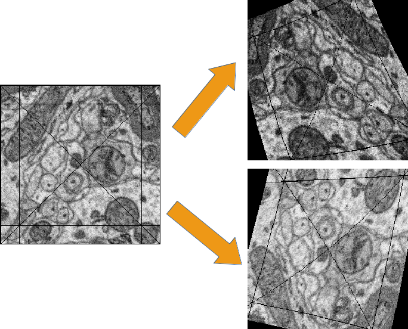

.. _training:

*****************************************
Practical Introduction to Neural Networks
*****************************************

.. contents::
	 :local:
	 :depth: 2

General
=======

Neural Networks (NNs), including CNNs as a special case, are a class of non-linear, parametrised functions mapping :math:`\mathbb{R}^N \rightarrow \mathbb{R}^M` - seen from very narrow point of view assumed for the sake of this practical tutorial, for a more comprehensive description refer to `Marius' Intro <http://www.elektronn.org/downloads/Intro-ANN.pdf>`_.

NNs are typically models for *supervised* training (excluding :ref:`auto encoders <autoencoder>`, which can be used for *unsupervised* tasks). This means the user must provide input *examples* and corresponding desired outputs, called *labels*. Together they form a *training set*. The deviation between current output and desired output is called *loss*. The parameters of the NN (also called synaptic *weights*) are optimised by gradient descent techniques in order to minimise the loss. Provided the training has been successful in minimising the training loss **and** the training examples cover a representative variety of input data, the NN will *generalise* i.e. it is able to produce good output *predictions* for **unseen** input data. The loss (or classification accuracy) should be evaluated on a hold out *validation* data set to give an estimate of the generalisation capability and to detect over-fitting.

NNs can outperform many other models but they are rather difficult to handle. In particular they demand many training examples and precise labels with little noise. Furthermore they might require a high number of trial runs with different architectures and meta-parameters until a good model is found. The reward is the prospect of state-of-the-art results that often outperform other methods.

.. _modes:

Operation Modes in ELEKTRONN
============================

Generally there are three *modes* of training set ups, supported by the built-in pipeline:

	- **img-img**: input data **and** output data are image-like (i.e. there exist neighbourhood relations between adjacent elements (pixels) in the data arrays. This property is irrespective of dimensionality and can also be seen as neighbourhoods of temporal nature). E.g. for neuron membrane segmentation the inputs are 3D EM-images and the labels images too, that have ``1`` for pixels in which a membrane is present and ``0`` for background.

  .. figure::  images/Img-Img.png
   :align:   center

   EM-Images and derived membrane labels from the ISBI 3D data set (the original labels contained neurite *IDs* and not neurite *boundaries*)

	- **img-scalar**: the input data is image like, but the labels correspond to the image as a *whole* - not to individual pixels/locations. E.g. "this image shows a cat" or "this is an image of digit 3"

  .. figure::  images/Img-Scalar.png
   :align:   center

   20 instances form the MNIST data set and their target labels.

	- **vect-scalar**: the input data is a vector of arbitrary features (i.e. there exists no relation between adjacent elements). This could also be a flattened image as in the :ref:`MNIST-example <mnist>`, but more illustrative are e.g. word counts of a document or demographic properties of persons as in the depicted example:

  .. figure::  images/Vect-Scalar.png
   :align:   center

   Exemplary features of the "Adult" data set and the (binary) prediction target.

Convolutions are only applicable for the first and second mode. Note that a neighbourhood relation can also be temporal e.g. a z-*stack* of 2D images (x,y-axes) from a video sequence: the images are ordered by time and a 3D convolution becomes a *spatio-temporal filter*.

The tutorial for the :ref:`training pipeline <pipeline>` assumes the operation mode *img-img*. *img-scalar* training is mentioned in comments and vect-scalar, both are demonstrated in the :ref:`MNIST-example <mnist>`.

Data Considerations
===================

Preprocessing
-------------

The training convergence is usually improved a lot by scaling the input data properly. However there is no single way to do this. Common methods are:
  - normalisation: scale range to (0,1)
  - standardisation: subtract mean and scale variance to 1 (where the mean and variances can be computed per pixel, per feature or over all inputs)
  - Whitening: like standardisation but including de-correlation of all features

For images normalisation to (0,1) works usually good and is most convenient - images stored as ``uint8`` (grayscale 0-255) are converted to float and normalised to (0,1) automatically by the :ref:`pipeline <data-format>`.

Label Quality
-------------

Training data must in general be densely labelled i.e. for each pixel of a raw image the corresponding pixel in the label image must contain the class index (or a float value for regression). In particular for object detection/classification this means all pixels of that object must carry the index of the class to which the object belongs. E.g. if the task is to detect cats, dogs and birds (their position in an image), every pixel of an animal's silhouette must carry the corresponding class index in the label image.
Noise in these annotations is bad (e.g. the labelled area is smaller or larger than the real object extent, the contours do not match). We found that CNNs can tolerate label noise well if there is a large number of training examples, that essentially average out the noise during the training.

The above does not apply to *img-scalar* training, since spatial relations are not considered.

Label Coverage
--------------

A CNN can only generalise well if the training data covers a great range/variety of possible inputs. This inevitably requires more amount of labelled data, often an expensive undertaking. To help out ELEKTRONN has special loss functions that allows training on data that is not densely labelled. This training mode still requires some dense examples but additionally allows you to provide data that is cheap and fast to annotate. For details see :ref:`lazy-labels <lazy-labels>`. The lazy labels method is not applicable to the *img-scalar* training.

If you generate ground truth be aware of the CNN offsets: to make a train at a location an image patch around the location ("context") must be provided as input. So if you have images of a certain size, you cannot make predictions or do training for the pixels which lie in a stripe close to the border. The thickness of this stripe is determined by the offsets, which in turn are determined by the size of the convolution filters. Never label data for in the border stripes in which you cannot make predictions, this is a waste of resources. Also see the notes in :ref:`data-format`:

Network Architecture
====================

When defining an architecture several things should be considered:

Convolutional Networks
----------------------

	* Filter sizes:
		- Larger filters increase the field of view.
		- Larger filters are slower to compute but do not require significantly more GPU-RAM.
		- Larger filters introduce more model parameters, but as the number of filters that can be used is limited by speed or GPU-RAM the greater "expressiveness" of larger filters might actually not be utilised and smaller filters are faster and could be equally good.
		- In the very first layer the filter size must be even if pooling by factor 2 is used. Otherwise output neurons lie "between" input pixels.
		- Filter sizes and pooling factors can defined for each dimension separately. This is useful if 3D data has anisotropic resolution or just "a little" information in the z-direction is needed. A useful and fast compromise between a plain 3D and 2D network is a CNN that has e.g. filter shape (4,4,1) in the first layers and later (2,2,2): this means the first part is basically a stack of parallel 2D CNNs which are later concatenated to 3D CNN. Such "flat" 3D CNNs are faster than their isotropic counterparts.
		- The last layers may have filter sizes (1,1,1) which means no convolution in any dimension and is equivalent to a stack of parallel fully connected layers (where the number of filters corresponds to the neuron count).

	* Number of Filters:
		- Due to larger feature map sizes in the first layers (before pooling) fewer filters can be used than in later layers.
		- A large number of filters in later layers may be cheap to compute for training as the feature map sizes are small but predictions still become expensive then.
		- Still it is advisable to have a tendency of increasing filter size for later layers. This can be motivated from the view, that early layers extract primitives (such as edges) and the number of relevant primitives is rather small compared to the number of relevant combinations of such primitives.

	* Maxpooling:
		- Reduces the feature map size of that layer, so subsequent layers are cheaper to compute.
		- Adds some translational invariance (e.g. it does not matter if an edge-pattern is a little bit more right or left). This is good to some extent, but too many consecutive poolings reduce localisation.
		- Increases the field of view of a single output neuron.
		- Results in *strided* output/predictions due to the down-sampling. Strided means the neurons after pooling correspond (spatially) to every second input neuron, by applying succesive poolings this becomes every fourth, eight and so on, the "stepsize" is called stride. Per layer for a given number of input neurons the number of output neurons is reduced by the pooling factor, this is important because too few output neurons give noisier gradients and the training progress might be slower. Another effect is that poolings make prediction more expensive, because the pixels "between the stride" must be predicted in another forward-pass through the CNN. The simple and slow way is iterating over all positions between the strides and accumulate the strided predictions to a dense image. The fast (and computationally optimal) way is to activate :ref:`mfp` which gives dense images directly but requires a lot of GPU-RAM.
		- The final strides in each dimension is the product of pooling factors in each dimension (e.g. 2**4=16), the number of total prediction positions (or fragments for MFP) is the product of all pooling factors: in 3D 4 poolings with factor 2 in all dimensions gives the astonishing number of 4096! As mentioned for the filter sizes below, it is possible to create "flat" 3D CNNs that avoid this, by applying the pooling only in x and y, not z with pooling factors written as (2,2,1).
		- It is recommended to use only poolings in the first layers and not more than in 4 layers in total. The value of the pooling factor should 2 be.

.. Note::
	To get centered field of views (this means label pixels are aligned with output neurons and do not lie "in between") when using pooling factors of 2, the filter size in the first layer must be even This is at first counter-intuitive because for an even-sized filter there is no "central" pixel, but if followed by a pooling with factor 2, this results in total in a centered output.

Multi Layer Perceptron (MLP)
----------------------------

	* MLP layers (Perceptron layers): these are only needed for *img-scalar* training. The image-like feature maps of the last convolutional layer are *flattened* to a vector and given as input to the perceptron layer, thus one or more perceptron layers can be attached. If the image-like extent of the last convolutional layer is large and/or the layer has many filters the flattened vector might be quite large. It is therefore advisable to reduce the image extent by using maxpooling in the layers to a small extent, e.g. 2x2(x2). The convolutional part can be interpreted as a feature extractor and perceptron layers as a classificator, but in fact this is rather a continuous transition. Each MLP layer is characterised by the number of (output) neurons.

.. Note::
 Always check the CNN architecture before starting a training by using :py:func:`net.netutils.CNNCalculator`. Only the input shapes listed in the attribute ``valid_inputs`` can be used. This is also applicable for *img-scalar* training, because for pooling by factor 2, the layers must have even sizes; if the desired architecture is not possible for the size of the images, the images must be constant-padded/cropped to change their size or the architecture must be changed.

It should be kept in mind that all training sets and training goals are different and the above instructions are just meant as a general guide. Various architecture versions should be tested against each other to find out what works well for a particular task.

Tweaks
======

A number of helpful CNN/NN tweaks is supported by ELEKETRONN and presented in this section.

Class weights
-------------

Often data sets are unbalanced (e.g. there are more background pixels than object pixels, or much more people earning less than 50 000 $). In such cases the classifier might get stuck predicting the most frequent class with high probability and assigning little probability to the remaining classes - but not actually learning the discrimination. Using class weights, the training errors (i.e. incentives)  can be changed to give the less frequent classes greater importance. This prevents the mentioned problem.

.. _warping:

Data Augmentation
-----------------

CNNs are well-performing classifiers, but require a lot of data examples to generalise well. A method to supply this demand is data *augmentation*: from the limited given data set (potentially infinitely) many examples are created by applying transforms under which the labels are expected to be constant. This is especially well suited for images.  In almost all cases small translations and changes in brightness and contrast leave the overall content intact.
In many cases rotations, mirroring, little scaling and minor warping deformations are possible, too. All mentioned transformations are implemented in the :ref:`pipeline <pipeline>` for images. For *img-img* training the labels are subjected to the geometric transformations jointly with the images (preserving the spatial correspondence). By applying the transformations with randomly drawn parameters the training set becomes arbitrarily large. But it should be noted that the augmented training inputs are *highly correlated* compared to genuinely new data. It should furthermore be noted, that the warping deformations require on average greater patch sizes (see black regions in image below) and thus the border regions are exposed to the classifier less frequently. This can be mitigated by applying the warps only to a fraction of the examples.

 Two exemplary results of random rotation, flipping, deformation and historgram augmentation. The black regions are only shown for illustration here, internally the data pipeline calculates the required input patch (larger than the CNN input size) such that if cropped to the CNN input size, after the transformation, no missing pixels remain. The labels would be transformed in the same way but are not shown here.

Dropout
-------

Dropout is a major regularisation technique for Neural Networks that improves generalisation. When using dropout for training, a fraction of neurons are turned off - but randomly, changing at every training iteration step. This can be interpreted as training an *ensemble* of networks (in which the members share common weights) and sampling members randomly every training step. To make a prediction the ensemble average is used, which can be *approximated* by turning all neurons on i.e. setting the dropout rate to 0 (because then the sum of incoming activations at a neuron is larger, the weights are rescaled automatically when changing the rate). Training with dropout requires more neurons per layer (i.e. more filters for CNNs), larger training times and larger learning rates. We recommend to first narrow down a useful architecture without dropout and from that point start experimenting with dropout.

Weight Decay
------------

Weight decay is synonymous with a L2 penalty on the weights. This means additional to the loss that comes from the deviation between current output and desired output, large weight values are regarded as loss - the weights are driven to have smaller magnitudes while at the same time being able to produce good output. This acts as a regulariser (see `Tikhonov Regularisation <https://en.wikipedia.org/wiki/Tikhonov_regularization>`_).

Input Noise
-----------

This source of randomisation adds Gaussian noise to the input of a layer (e.g. in the central layer of an auto encoder). Thereby the NN is forced to be invariant and robust against small differences in the input and to generalise better. Input noise is somewhat similar to drop out, but contrast drop out sets certain inputs to 0 randomly.

Training / Optimisation
=======================

Because of the non-linear activation functions, the loss function of an NNs is a highly non-convex function of its weights. Analytic solutions do not exist, so we optimize using gradient descent techniques with various heuristics. Convergence is a user-defined state, either determined by good enough results (no progress possible any more) or by the point where the loss on a held out *validation set* begins to increase, while the loss on the training set still decreases - continuing training in this situation inevitably leads to over-fitting and bad generalisation.

Stochastic Gradient Descent (SGD)
---------------------------------

This is the basic principle behind all other optimisers. SGD is the most common optimisation scheme and works in most cases. One advantage of SGD is that it works well with only one example per batch.

In every iteration:
	- From the training data one or several examples are drawn. The number of drawn examples is called *batch size*.
	- The output of the NN, given the current weights, is calculated
	- The **gradient** of the loss (deviation between output and desired output) is calculated w.r.t to the weights
	- The weights are *updated* by following down the gradient for a fixed step size - the *learning rate*
	- The whole procedure is repeated with a new batch until convergence

The learning rate is usually decreased by schedule over the time of the training.

.. figure::  images/gradient-descent.png
 :align:   center

Illustration of gradient descent on error surface a 2-D, this corresponds to a model with just two parameters. As can be seen, the outcome depends on the starting point (aka *weight initialisation*) and may lead to different *local* optima. For more dimensions the problem of multiple local optima is even more severe. If you train a network twice under same conditions except for the random weight initialisation and the random batch shuffling, you will almost definitely end up in completely different local optima. But empirically the performance is pretty close.  In practice another difficulty is more relevant: saddle-points which may ill-condition the training. [`img source <http://blog.datumbox.com/tuning-the-learning-rate-in-gradient-descent/>`_]

Momentum
++++++++

Momentum replaces the true gradient by an exponential moving average over the previous gradients. This can speed up progress by accumulation of gradients and prevent over-fitting to only the current example by averaging over other examples. Momentum is parametrised by a meta-parameter that determines the mixing rate of the previous gradients and the current gradient. In the picture of the error surface it can be visualised by a massive ball rolling down the hill which, through its mass, can accumulate speed/momentum and also go upwards shortly - across a small ridge for example.

Resilient Backpropagation (RPROP)
---------------------------------

RPROP is a heuristic that determines the learning rate for every parameter individually based on the criterion how often the sign of the gradient changes over the iterations. If the sign stays the same for a long time the learning rate grows (similar to momentum) and if the sign fluctuates a lot, very small steps are made for this parameter.
RPROP can be very fast and good but can also to be too aggressive for some data sets or small batch sizes leaving a larger spread between training loss and validation loss.

Conjugate Gradient (CG)
-----------------------

Conjugate gradient uses a heuristic to estimate the value of the momentum meta-parameter in every iteration step. In addition, the learning rate is not fixed but the optimal step size is found by a bounded line search along the gradient direction. CG requires multiple steps on the same batch for the heuristic to work.

CG needs fewer iteration steps but is slower per step. Larger batch sizes are needed because several steps are done per same batch. Generalisation properties can be superior to SGD and it can even be faster but that depends on the particular data set and careful tuning of meta-parameters. Further detail on `the wikipedia article <https://en.wikipedia.org/wiki/Nonlinear_conjugate_gradient_method>`_ (we use the Polak–Ribière heuristic).

l-BFGS
------

Limited-memory Broyden–Fletcher–Goldfarb–Shanno (l-BFGS) aims at estimating the inverse Hessian from the history of gradients. Similar to CG this history must be acquired on the same batch and the number of steps on the same batch is even higher. Using the approximate inverse Hessian, parameter updates can be made with a second order correction (in contrast plain gradient descent is a linear approximation). Again batch sizes must be larger because of the high number of steps per batch. Further reading is advisable: `used implementation <https://docs.scipy.org/doc/scipy/reference/generated/scipy.optimize.fmin_l_bfgs_b.html>`_ and `wikipedia entry <https://en.wikipedia.org/wiki/Limited-memory_BFGS>`_.

Tips for Tuning
===============

The learning rate should be as large as possible at the beginning of the training and decrease gradually or in steps (optimally always after the loss has plateaued for some time). Conversely the momentum should be raised towards the end of the training but it can also be kept constant.
As learning rate as large as possible means the following: since the gradient is only a linear approximation, the loss decreases only along a small step size on the gradient and goes up again for larger steps (very quickly). Thus by setting a fixed learning rate, some update steps may in fact lead to an increase of the loss if they are too large. The learning rate should be so large that **most** of the updates decrease the loss but large enough that a few steps lead to increases - because then you know that a greater learning rate would not be possible. The training pipeline creates a plot with the per step changes of the loss.

The learning rate depends on the NN architecture and the batch size. Deeper nets commonly require smaller learning rates. Larger batches can go with larger learning rates (there is less noise in the gradients).

