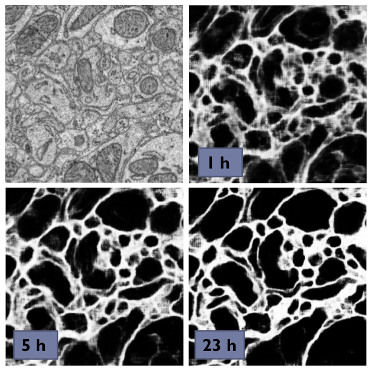

.. _pipeline:

***************************
Using the Training Pipeline
***************************

This page gives further details about the steps described in :ref:`the basic recipe <basic-recipe>` and describes the all configurable options for the pipeline of the ``training`` package.

.. contents::
	 :local:
	 :depth: 1

How it works
============

After you set up the configuration and run ``elektronn-train``:

	- The configuration file is parsed and some consistency checks are made (but not every possible combination of anything...). From the architecture parameters a :py:func:`elektronn.net.netutils.CNNCalculator` object is created (this checks the architecture and gives a list of valid input sizes, from which the closest is chosen automatically).
	- A save directory is created, the ``cwd`` is set to this directory, the configuration file is copied to a ``Backup`` sub-directory in the save directory.
	- A :py:class:`elektronn.training.CNNData.CNNData` object is created. All CNN relevant architecture parameters (input size, offsets, strides etc.) are passed over, such that suitable patches for training can be created. The data is read from disk into (CPU-)RAM. The required RAM is approx. (number of training image pixels) * 32bit + (number of training label pixels) * 16bit. The sub-processes for don't copy the data, so using the does not increase the physical RAM usage a lot.
	- The CNN is created and the training functions are compiled. Compilation of the gradient can take up to several minutes the first time. For subsequent runs, parts of the binaries are cached and compilation becomes significantly faster.
	- The training loop starts. In each iteration:
		* From the whole training data set a batch is created by sampling random locations in the image arrays and "cutting" patches from these locations. The patches are augmented randomly according to the configuration.
		* The CNN makes one update step on the batch (or several steps for CG and l-BFGS)
		* Every ``history_freq`` steps: the current performance is estimated on a larger number of *monitor patches*. Some numbers are printed, plots are made, and a log file is dumped into ``Backup``.
		* A backup of the current parameters is overwritten every ``history_freq`` steps
		* Every hour a persistent snapshot of the CNN parameters/weights is saved
		* Every 3 hours the training is paused and a sample image is predicted as a preview (firstly after 1 hour)

	- During this iteration you can use the :ref:`CNN console <console>` accessible via ``ctrl+c``.
	- After the maximal steps or maximal runtime are reached, everything is shutdown and the latest parameters are written to disk.

.. _data-format:

Data Format
===========

Transform your data arrays to h5 data sets in separate files for images and labels.

	* images: shape (x,y,z)  or (channel,x,y,z), either ``float`` (0,1) or ``uint8`` (0,255)
	* labels: shape (x,y,z)
	* for classification: labels contain integer numbers encoding the class membership, starting from 0, consecutively to (#classes-1)
	* for regression: labels contain float numbers
	* for 2D images the dimension ``z`` can be viewed as the axis along which the instances of the training set are stacked
	* for whole image classification the labels must be 1d
    * The z-axis is the the axis which has different units than x and y (e.g. different spatial resolution, or time).

.. Note::
    For classification tasks you must think of a suitable way to present the training images to the CNN. E.g. if you want to do neurite segmentation in EM images and you have ground truth images in which each pixel carries the ID of the neurite it belongs to, this will not work by using this ground truth as labels directly: the IDs are arbitrary (they could also be permuted) and there may be thousands of distinct IDs, a CNN cannot learn this representation. The task must be formulated in such a way that there are just a few *general* classes - in this case membrane boundaries and background (or other objects such as mitochondria). The conversion of ground truth is a step that must be carried out by yourself depending on your particular problem that you want to solve.

    .. figure::  images/Conversion.png
      :align:   center

      Conversion of ID-labels to a binary boundary map.

.. Note::
	For 2D data you can stack the set of 2D images (and likewise the labels) to a cube and train by iterating over the z-slices (then the option ``anisotropic_data`` must be set to ``True``).

.. Note::
	For *img-scalar* training the labels which correspond to a stack of 2D images (see note above) are a vector with an entry for every image.

In the configuration file **two** lists must be specified consisting of tuples of the form *(<file name>, <h5 data set name/key in that file>)*. One list for the images and one for the labels, both must have the **same** order.

The data types are preferably ``uint8`` which makes files small and loading fast (255 gray values for images). For the labels it pays off to use the compression option of h5 (they might be compressible by a great factor). Note that in :py:class:`elektronn.training.CNNData.CNNData` the integer image data is internally converted to ``float32`` and divided by 255 (to normalise it to [0,1]); the labels to ``int16`` for classification or ``float32`` for regression.

Offsets for *img-img* Training
------------------------------

CNNs can only make predictions with offsets from the image border (see the image :ref:`below <batch>`. The offset is cause by convolutions with boundary mode "valid" (the size of the offset can be calculated using :py:func:`elektronn.net.netutils.CNNCalculator`). This implies that for a given labelled image area the raw image area required is larger. So if possible, provide images that are larger than the labels by at least the offset, to make *full use* of you labelled data. Or conversely never label your data in the offset stripes!
The only important condition is that the labels and images must be symmetrically registered to their center. Then the images are cropped or the labels are 0-padded depending on the offset automatically. A 1d example: label.shape=(5) and image.shape=(7) ---> the offset is 1 (on either side) and image[i+1] corresponds to label[i]; in particular image[3] corresponds to label[2], the centers of both arrays.

.. _configuration:

Configuration of Parameters
===========================

There are three levels of parameter configuration, **higher levels override previous levels**:
  1. The master *default* values are hardcoded into python code in :py:class:`elektronn.training.config.MasterConfig`.
  2. Users can set their own *default* values by editing the file ``examples/config_template.py`` (which is just a template and otherwise **ignored**). The user file must be put into the home directory as ``~/.elektronn.config``, from there is automatically read and overrides the master defaults. The *default* values found in the template are intended to provide guidance on some meta-parameters (e.g. learning rate, momentum) and to define certain behaviour of the pipeline (e.g. default save path, save intervals), see section :ref:`Pipeline Setup <setup>`.
  3. *Specific* values for training a particular CNN/NN configuration should be set in a different file (again by editing ``config_template.py`` as new file). The path of this file is given as the ``config`` argument to the ``elektronn-train``-script. *Specific* values can override any default values and are mainly used to specify the CNN architecture and the training data options. Some values are mandatory to be provided specifically for each training (e.g. network architecture, data files, save name) - if such a value is not provided a warning is shown.

The configuration file is basically a python file that contains assignments of values to variables. You can use even use list comprehensions to create lists of file names, but then you must ``del`` the iteration variable (because this variable would also be read in, but it is not a valid config value) e.g::

	d_files          = [('imgs_padd_%i.h5' % ii, 'raw') for ii in range(8)]
	l_files          = [('mem_z_%i.h5' % ii, 'labels') for ii in range(8)]
	del ii

This page only describes what the values do, for advice on how to find good settings refer to the section :ref:`training`.

The "mode" coloumn indicates whether a parameter should be set by the user (!) or if this parameters is only needed in special cases and need not be configured normally ($). No indication means it can be left at default initially, but tweaking might improve results. Default ``undefined`` means that there might be some value as default, but you should not assume that the default value is sufficient for your situation.

.. Note::
  These configurations do not configure theano (except for the option to set a default device). Theano must be configured via `.theanorc <http://deeplearning.net/software/theano/library/config.html#libdoc-config>`_, also see :ref:`installation`.

.. _setup:

General Setup
-------------

======================= =======	=========================== 	=============== ===========
Name			Mode	Type				Default		Explanation
======================= =======	=========================== 	=============== ===========
save_path			``string`` (trailing '/'!)	``undefined``	At this location a **new** directory with the name ``save_name`` is created. If this directory not exists it is created.
plot_on			$	``bool``			``True``	If ``True`` frequently plots of the training progress are created and saved to the save directory. As plotting is done in a sub-process this does not slow down training.
print_status		$	``bool``			``True``	If ``True`` frequently several values (loss, training error, validation error if available etc.) are printed to the console
device           		``False``/``int`` 		False  		Default device to initialise, if not given as commandline arg. False --> use .theanorc value or int --> use gpu<i>
param_save_h     		``float`` 			1.0		hours: frequency to save a permanent parameter snapshot
initial_prev_h  		``float``  			1.0		hours: time after which first preview is made
prev_save_h     		``float``  			3.0		hours: frequency to create previews
======================= =======	===========================	===============	===========

Paths and General
-----------------

======================= =======	=========================== 	=============== ===========
Name			Mode	Type				Default		Explanation
======================= =======	=========================== 	=============== ===========
save_name		!	``string``			``undefined``	The name of the save directory and the prefix for all created files
overwrite			``bool``			``True``	If set to ``False`` and the Training script finds an existing directory of same name, it terminates before overwriting any files. Use as a safeguard.
param_file		$	``string``			``None``	Absolute path of a parameter file. A new network can be initialised with parameters of another (already trained) network.
======================= =======	===========================	===============	===========

Network Architecture
--------------------

.. note::
	The output layer is added automatically (with ``n_lab`` outputs). I.e. the total number of layers is ``len(nof_filters)+ len(MLP_layers) + 1``.

General
+++++++

======================= =======	========================== 	=============== ===========
Name			Mode	Type				Default		Explanation
======================= =======	========================== 	=============== ===========
activation_func			``string`` or list therof	'relu'		Global value or entry per layer. Possible values are: tanh, abs, linear, sig, relu. If list, length must equal  number of specified layers (conv+mlp).
batch_size		!	``int``				1		Number of patches (i.e. training examples sliced from different locations in the training data) to use for an update step.
dropout_rates   		list of ``float`` (0,1)		``[]``          The "fail"-rates per layer or globally. Empty list disables dropout. The last layer has always no dropout. If list, length must equal  number of specified layers (conv+mlp).
======================= =======	==========================	=============== ===========

Convolutional
+++++++++++++

======================= =======	==========================	=============== ===========
Name			Mode	Type				Default		Explanation
======================= =======	========================== 	=============== ===========
n_dim			!	``int``				2		Spatial dimensionality of CNN (2 or 3). Channels of multi-channels input images (e.g. RGB) are not counted as a dimension as they are not spatial.
desired_input		!	``int`` or 2/3-tuple		200		Desired input size. This must be smaller than the size of the training images. If this is a scalar the size is used in all dimensions, if a tuple is uses each dimension has another size (only the z-dimension should be smaller for "flat" CNNs or anisotropic data). These sizes are not directly used but the next size that gives a valid architectures is automatically selected.
filters			!	see note 2			``undefined``	List of filter size in each layer
pool			!	see note 2			``undefined``	List of maxpooling factor for each layer
nof_filters		!	list of ``int``			``undefined``	List of number of filters for each layer
pooling_mode            $       ``string`` or list thereof	'max'           Select pooling function (globally or per layer). Available: 'max', 'maxabs'. Maxabs takes maximum over absolute values, but then adds sign again to the value.
MFP			!	list of ``bool`` or 0/1		``[]``		List whether to apply max fragment pooling for each layer. MFP is only intended for prediction, so for training the emtpy list disables MFP.
======================= =======	========================== 	=============== ===========

.. note::
	The parameters ``filters`` and  ``pool`` can either be lists of ints or lists of 2/3-tuples of ints. For simple lists of ints the scalar values are used in all 2/3 CNN dimensions, for tuples each dimension has its own value. E.g. ``[[2,2,2], [3,3,3], [2,2,2],...]`` is identical to ``[2,3,2,...]``, in contrast anisotropic filters are declared like ``[[2,2,1],[3,3,2],...]``.

Multi Layer Perceptron (MLP) and Others
+++++++++++++++++++++++++++++++++++++++

======================= =======	======================= =============== ===========
Name			Mode	Type			Default		Explanation
======================= =======	======================= =============== ===========
rnn_layer_kwargs        $       ``dict``/``None``	``None``	This can install a recurrent layer before MLP-layers, the kwargs are passed to :py:meth:`net.MixedConvNN.addRecurrentLayer`. It does not together with conv-layers.
MLP_layers              !       list of ``int``		``[]``          Numbers of neurons for fully connected layers after conv layers. Empty for img-img training and required for img-scalar training
target                          ``string``		'nll'		Loss function, 'nll' or 'regression'
======================= =======	======================= =============== ===========

Data Options
------------

General
+++++++

========================= 	=======	============================== 	=============== ===========
Name			  	Mode	Type				Default		Explanation
========================= 	=======	============================== 	=============== ===========
mode				!	``string``			"img-img"       Mode of data and label types: ``img-img``, ``img-scalar``, ``vect-scalar``, see :ref:`Modes <modes>`.
background_processes	  	!	``bool``/``int``		``False``	Whether to "pre-fetch" batches in separate background process. This is advisable set to ``True`` or specify a number of cores in order to speed up training, especially when warping is used.  <Bool> or number of processes (True-->2).
n_lab				!	``int`` or ``None``		``undefined``	Number of distinct labels i.e. different classes. If ``None`` this is detected automatically, but that is very slow.
========================= 	=======	============================== 	=============== ===========

.. warning::
	When using background processes, the main process should not be killed from outside. Instead abort using the CNN console via ``ctrl+c`` and ``kill`` or ``abort``, otherwise the sub-processes become zombies and clutter the RAM.

Images/CNN
++++++++++

This block is ignored for mode ``vect-scalar``

========================= 	=======	==============================	=============== ===========
Name			  	Mode	Type				Default		Explanation
========================= 	=======	============================== 	=============== ===========
data_path			!	``string`` (trailing '/'!)	``undefined``	Path to directory of training data files (raw images)
label_path			!	``string`` (trailing '/'!)	``undefined``	Path to directory of training label files
d_files				!	list of tuples			``undefined``	The data files to use from the directory. Tuples contain (<file name>(``string``), <h5 data set name/key in that file>(``string``)). E.g. ``[('img1.h5', 'raw'),('img2.h5', 'raw')]``
l_files				!	list of tuples			``undefined``	The label files to use from the directory. As above and in the same order!
cube_prios			  	``None`` or list of ``float``	``None``	List of SGD-sampling priorities for cubes (it must be in the same order as ``d_files``! ). The priorities are relative and need not be normalised. If ``None`` sampling probability ~ cube size
valid_cubes			  	list of ``int``			[]		List of cube indices (corresponding to ``d_files``) to use as validation data. May be empty, then validation performances are shown as ``nan``.
example_ignore_threshold 	$	``float``			0.0         	If the fraction of negative (this denotes unlabelled pixels) in an example patch exceeds this value, the patch is discarded and a new patch is fetched. Only needed if there are negative / unlabelled labels at all.
grey_augment_channels	  	!	list of ``int``			[0]		Channel-indices to apply random grey value augmentation (GA) to. Use ``[]`` to disable. GA distorts the histogram of the raw images (darker, lighter, more/less contrast).
use_example_weights 		$	``Bool``			 False          Whether to use weights for the examples (e.g. for Boosting-like training). Not documented atm
flip_data				``bool``			``True``	Whether to randomly flip/rotate/mirror data for augmentation.
anisotropic_data	  	!	``bool``			``True``	If ``True`` 2D slices are only cut in z-direction, otherwise all 3 alignments are used. This can be use to train on 2D images stored as 3D arrays.
lazy_labels		  	$	``bool``			``False``	``True`` activates special Training with lazy annotations (see :ref:`lazy labels <lazy-labels>`).
warp_on			  	!	``bool`` / ``float``		``False``	``True`` activates random warping deformations of training examples for augmentation. Alternatively a ``float`` (0,1) can be used to warp only a fraction of examples randomly. If this options is used, background processes should be used at the same time. Note: to make apply warping the images/cubes must be larger than the CNN patch size : the warping parameters are sampled randomly and the the required patch size (to arrive at the CNN patch size *after* warping) is determined. If the required size is larger than the training images, the example is not warped (without a message). You can inspect if it works by using the CNN console and comparing ``data.n_failed_warp`` to ``data.n_successful_warp`` (you must not use background processes to make the inspection, because you cannot see their attribute values in the main thread).
pre_process      		$	``string``/``None``		None             Currently implemented: "standardise" --> 0-mean, 1-std (over all pixels)
zchxy_order				``bool``			``False``       Set to ``True`` if data is in (z, (ch,) x, y) order, otherwise (ch, x, y, z) is assumed. z as first axis is slightly faster when loading data but for the actual training it is indifferent.
border_mode			!	``string``			"crop"		Only applicable for *img-scalar*. If the CNN does not allow the original size of the images the following options are available: "crop": cut the images to the next smaller valid input size, "0-pad" pad to the next bigger valid input with zeros, "c-pad" pad to the next bigger input with the average value of the border, "mirror" and "reject" which throws an exception.
upright_x        			``Bool``			False           If true, mirroring is only applied horizontally (e.g. for outdoor images or handwriting)
downsample_xy    			``Bool``/``int``		False           Down-sample training data in x/y direction by this factor (or not at all if False)
preview_data_path 			``string``/``None``		None            Path to a h5-file that contains data to make preview prediction images. The h5 data set must contain a one or more image cubes (normalised between 0 and 255) in the shape ((ch,) x,y,z). If ``None`` no previews are made.
preview_kwargs    			``dict``					Specification of preview to create, see :py:meth:`training.trainer.Trainer.previewSlice`, only specify ``export_class`` and ``max_z_pred``, the ``number`` is generated automatically.
========================= 	=======	==============================	=============== ===========

 A series of 3 preview predictions and the corresponding raw image. Note that the prediction of previews might consume a lot of time; for complex CNNs (with a lot of poolings) only use small preview images.

Alternative / *vect-scalar* Data Options
++++++++++++++++++++++++++++++++++++++++

These replace the options from the image section, and import a data class from :py:mod:`elektronn.training.TrainData`.

======================= =======	========================== 	=============== ===========
Name			Mode	Type				Default		Explanation
======================= =======	========================== 	=============== ===========
data_class_name      		``string``			``None``        Name of data class in :py:mod:`elektronn.training.TrainData` or ``tuple`` for implementation in user file (<file_path>, <class_name_in_file>) e.g. ``('~/MyData.py', 'MyClass')``
data_load_kwargs     		``dict``			``dict()``      Arguments to init data class
data_batch_kwargs    		``dict``			``dict()``      Arguments for ``getbach`` method of data class (e.g. special augmentations). The batch_size argument is added automatically and needn't be specified here
======================= =======	========================== 	=============== ===========

Optimisation Options
--------------------

======================= =======	============================== 	=============== ===========
Name			Mode	Type				Default		Explanation
======================= =======	============================== 	=============== ===========
n_steps			!	``int``				``undefined``	Number of maximal update steps
max_runtime		!	``int``				``undefined``	Maximal training time in seconds, may lead to termination before ``n_steps``. Measured is the total time including batch creation and performance estimates
history_freq		!	list of  1 ``int`` (!)		[2000]		Every ``history_freq`` training steps several values (NLL, training error, validation error if available etc.) are calculated and stored in an internal hisotry file. If the corresponding options are activated these values are also printed and plots are created.
monitor_batch_size		``int``				10		Number of patches to test model for online performance estimation (on training set and if available on validation set)
weight_decay          	$	``bool`` or ``float``		``False``       L2-penalty on weights with this weight relative to the gradient of the loss. ``False`` is equal to 0.0
class_weights			list of ``float``/``None``	``None``	Importance weights for the classes (must have length ``n_lab``), will be normalised internally. Weighting disabled by ``None``.
label_prop_thresh		``None`` or ``float`` (0.5,1)   ``None``	This threshold allows unsupervised label propagation (only for examples with negative/ignore labels).If the predictive probability of the most likely class exceeds the threshold, this class is assumed to be the correct label and the training is pushed in this direction. Should only be used with pre-trained networks, and values <= 0.5 are disabled. ``None`` disables this option.
optimizer         		``string``			'SGD'           Select 'SGD'/'CG'/'RPORP'/'LBFGS' as optimiser method for training
LR_decay              		``float``			0.993   	Decay multiplier for SGD learning rate w.r.t to an interval of 1000 update steps
LR_schedule           		List of tuples /``None`` 	None		At the specified iteration steps the LR is set to the specified value. This is independent of the decay. Each entry in the list is of format (#iteration, new_LR) e.g. ``[(80000, 0.04),  (50000, 0.001)]``
======================= =======	==============================	=============== ===========

.. note::
	Regarding ``history_freq``:
	If the training or validation errors are estimated on many examples (``monitor_batch_size``) this might take a while, therefore if you plan to train for 24 hours you should not create an output every 10 seconds but rather every 30 minutes (values 2000 to 5000). But for debugging and checking if a new training case works, it might be usefull to get several plots per minute (values 20 to 200) and use fewer monitor examples. If you know it works, you can raise the value online using the CNN console via ``ctrl+c``. Although this parameter is scalar it is a list for internal reasons.

Optimiser Hyperparameters
-------------------------

======================= =======	======================= =============== ===========
Name			Mode	Type			Default		Explanation
======================= =======	======================= =============== ===========
SGD_params		!	dict			see file	Initial learning rate and momentum for SGD
RPROP_params		$	dict			see file	see code
CG_params		$	dict			see file	Keys: 'n_steps': update steps per same batch 3 <--> 6, 'alpha': termination criterion of line search, must be <= 0.35, 'beta': precision of line search, imprecise 0.5 <--> 0.9 precise, 'max_step'/'min_step': similar to learning rate in SGD 0.1 <--> 0.001.
LBFGS_params		$	dict			see file	see code and `here <http://docs.scipy.org/doc/scipy-0.15.1/reference/generated/scipy.optimize.fmin_l_bfgs_b.html>`_
======================= =======	======================= =============== ===========

Running elektronn-train
=======================

Once the parameter file is set up, the training script can be started. Run the script ``elektronn-train`` from command line::

	elektronn-train </path/to_config_file> [ --gpu={Auto|False|<int>}]

or from an existing python interpreter (e.g. within spyder).

.. note::
	 Using ``False`` as ``gpu`` arguments means a fallback to the configured device in ``.theanorc`` (which might be CPU). Otherwise it is advisable give the number of of the target GPU directly as the automatic selection of a free GPU might not work for all drivers (it looks up the power state using nvidia-smi). If the system has only one GPU its number is 0.

.. _console:

CNN Command Line
================

During training various changes to the setup can be made using the console which is accessible via ``ctrl+c``::

	ELEKTRONN MENU
	==============

	    >> MNIST <<
	    Shortcuts:
	    'q' (leave menu),		    'abort' (saving params),
	    'kill'(no saving),		    'save'/'load' (opt:filename),
	    'sf'/' (show filters)',	    'smooth' (smooth filters),
	    'sethist <int>',		    'setlr <float>',
	    'setmom <float>' ,		    'params' print info,
	    Change Training Optimizer :('SGD','CG', 'RPROP', 'LBFGS')
	    For everything else enter a command in the command line

	mfk@ELEKTRONN:

The following manipulations are possible:
	- Typing any of the above keywords (with optional arguments) and press `Enter`
	- "Free" input without parenthesis is translated to printing the value of the variable by that name, e.g.:

	>>> mfk@ELEKTRONN: cnn.input_shape
	(50, 1, 26, 26)

	- "Free" input with parenthesis is translated to executing that command literally e.g.

	>>> mfk@ELEKTRONN: cnn.setDropoutRates([0.5, 0.5, 0.5, 1.0])

	- If the return value of a function/method is to be printed, ``print`` must be added explicitly (otherwise it is just executed):

	>>> mfk@ELEKTRONN: print cnn.SGD_LR.get_value()
	>>> 0.00995

	- Value assignments and variable instantiation are possible, too
	- The command line resides within the scope of the training loop (``run`` method) of :py:class:`elektronn.training.trainer.Trainer` the and has access to:
		* The trainer object by ``self``
		* An instance of :py:func:`elektronn.net.convnet.MixedConvNN` by ``cnn``
		* An instance of :py:func:`elektronn.training.trainutils.Config` by ``config``
		* An instance of :py:func:`elektronn.training.CNNData.CNNData` by ``data``

The purpose of the command line is to allow the change of meta-parameters during training and to allow the inspection of the state of variables/parameters.

.. _batch:

A particular useful function for debugging gives a visual output of the training examples presented to the CNN::

  >>> data, label, info1, info2 = self.debugGetCNNBatch()

This fetches a in exactly the same way as is done for every training iteration. The ``info`` variables are for internal use when lazy labels are active, and not of interest here. Besides returning the data and label array this function also prints an image into the save directory name ``debugGetCNNBatch.png``:

  .. figure::  images/Batch.png
   :align:   center

  Left: the input data. Middle the labels, note the large offset, this CNN has a very larger field of view it needs 63 pixels on either side to make a prediction for the central pixel. Right: overlay of data with labels, here you can check whether they are properly registered.

For 3D CNNs the image shows a slice along the z-axis of the data.

.. note::
	Some parameters cannot be changed or their change has no effect. This is mainly true for all properties that are hard-compiled into the theano functions like the network architecture (e.g. number of neurons per layer).

